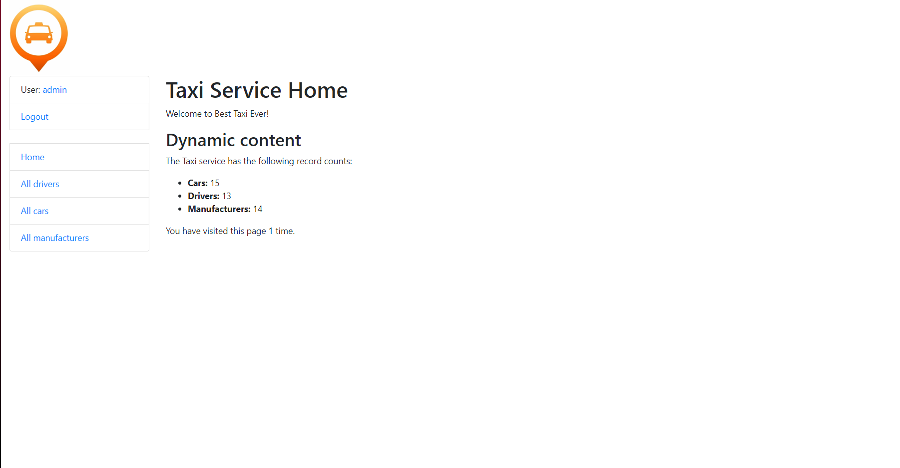

# Taxi Service

Django project for managing drivers, cars, and manufacturers.

## Check it out!
Project was deployed on [Render](https://taxi-service-2j2h.onrender.com) (tap to see it).

Guest account credentials:
* Username: Guest
* Password: Anonymous1234

## Features

* Authentication functionality for Driver/User
* Managing drivers, cars, manufacturers with website interface
* Powerful admin panel for advanced managing

## Demo


## Installation

Python3 is required

```shell
git clone https://github.com/Kev1nXD/taxi_service.git
cd taxi_service
python3 -m venvvenv
venv\Scripts\activate (on Windows)
source venv/bin/activate (on macOS)
pip install -r requirements.txt
python manage.py runserver
```

After all commands you have run, you will see a local link on a website in your terminal.

### Initial Configuration

to get access to pages with limited access you will need to create superuser
and log in with credentials you inserted on log in page:
```shell
python manage.py createsuperuser
```